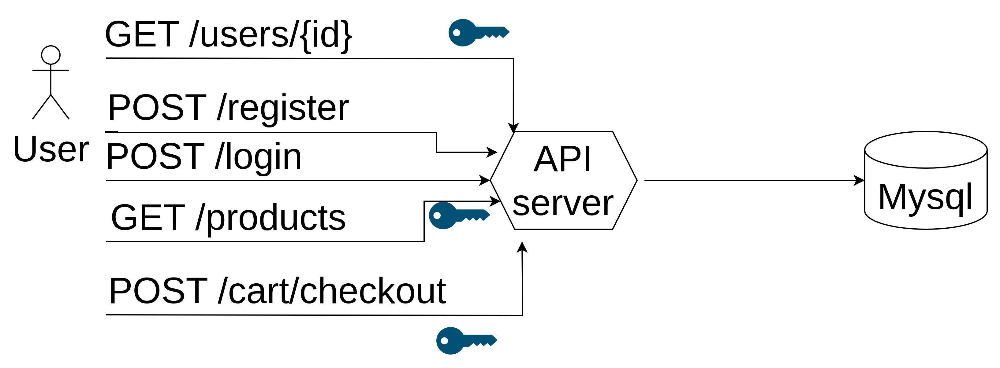
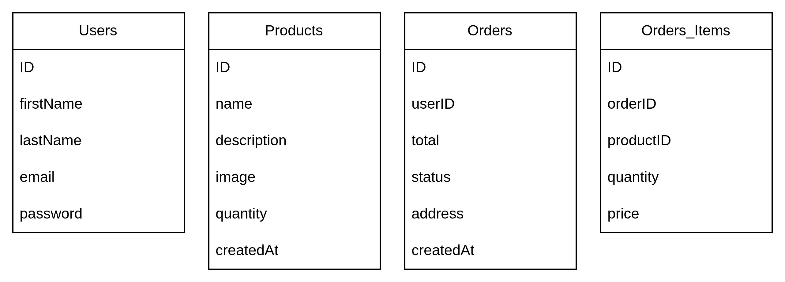

# golang-ecom-sample

This repository is implementation ecom api server with golang

## architecture



## package dependency

1. gorilla mux

```shell
go get github.com/gorilla/mux
```

2. mysql driver
```shell
go get github.com/go-sql-driver/mysql
```

3. viper for env loading
```shell
go get github.com/spf13/vipe
```

## steps

### setup http handler

use gorilla mux to create router
```golang
func (s *APIServer) Run() error {
	router := mux.NewRouter()
	subrouter := router.PathPrefix("/api/v1").Subrouter()

	userHandler := user.NewHandler()
	userHandler.RegisterRoutes(subrouter)
	log.Println("Listening on", s.addr)
	return http.ListenAndServe(s.addr, router)
}
```

### setup handler in services

```golang
package user

import (
	"net/http"

	"github.com/gorilla/mux"
)

type Handler struct {
}

func NewHandler() *Handler {
	return &Handler{}
}

func (h *Handler) RegisterRoutes(router *mux.Router) {
	router.HandleFunc("/login", h.handleLogin).Methods("POST")
	router.HandleFunc("/register", h.handleRegister).Methods("POST")
}

func (h *Handler) handleLogin(w http.ResponseWriter, r *http.Request) {

}

func (h *Handler) handleRegister(w http.ResponseWriter, r *http.Request) {

}
```

### setup db connection

```golang
func NewMYSQLStorage(cfg mysql.Config) (*sql.DB, error) {
	db, err := sql.Open("mysql", cfg.FormatDSN())
	if err != nil {
		log.Fatal(err)
	}

	return db, nil
}
```

### setup environment loader

```golang
package config

import (
	"log"

	"github.com/spf13/viper"
)

type Config struct {
	PORT string `mapstructure:"PORT"`

	MYSQL_DATABASE string `mapstructure:"MYSQL_DATABASE"`
	MYSQL_USER     string `mapstructure:"MYSQL_USER"`
	MYSQL_PASSWORD string `mapstructure:"MYSQL_PASSWORD"`
	MYSQL_ADDR     string `mapstructure:"MYSQL_ADDR"`
}

var C *Config

func init() {
	v := viper.New()
	v.AddConfigPath(".")
	v.SetConfigName(".env")
	v.SetConfigType("env")
	err := v.ReadInConfig()
	if err != nil {
		failOnError(err, "Failed to read config")
	}
	v.AutomaticEnv()

	err = v.Unmarshal(&C)
	if err != nil {
		failOnError(err, "Failed to read enivroment")
	}
}

func failOnError(err error, msg string) {
	if err != nil {
		log.Fatalf("%s: %s", msg, err)
	}
}
```
### schema


### setup store

### setup bcrypt

```shell
go get golang.org/x/crypto/bcrypt
```

```golang
package auth

import "golang.org/x/crypto/bcrypt"

func HashPassword(password string) (string, error) {
	hash, err := bcrypt.GenerateFromPassword([]byte(password), bcrypt.DefaultCost)
	if err != nil {
		return "", err
	}
	return string(hash), nil
}
```
### setup migrations

```shell
go get github.com/golang-migrate/migrate/v4
```

install cli
```shell
brew install golang-migrate
```

setup makefile comman
```makefile
migration:
  @migrate create -ext sql -dir cmd/migrate/migrations $(filter-out $@, $(MAKECMDGOALS))

migrate-up:
	@go run cmd/migrate/main.go up

migrate-down:
  @go run cmd/migrate/main.go down
```